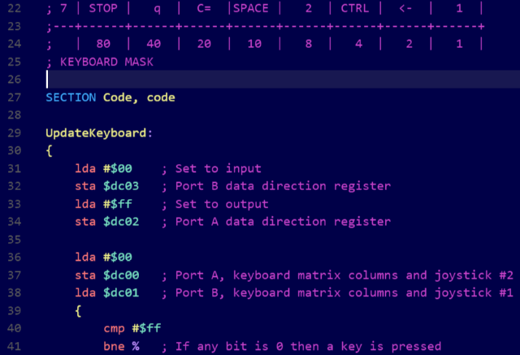

# x65 - Visual Studio Code Text Package

[Visual Studio Code](http://code.visualstudio.com/) is a funny little simple text editor with surprising extensibility. This little editor has matured and it's worth exploring.

As I don't like the marketplaceification of seemingly simple tools I'm not putting this on the visual studio coded marketplace, but if anyone wants to do that I don't mind.

In order to "side load" this extension into visual studio code follow these steps

Windows:

1. Make sure Visual Studio Code is installed
2. Run vscode\install.bat

Mac / Linux:

1. Install Visual Studio Code unless already Installed
2. Go to the visual studio code extension folder
 * Mac ~/.vscode/extensions
 * Linux ~/.vscode/extensions
3. Create a folder named x65
4. Copy the contents of this folder
5. Start Visual Studio code, change your theme to x65 which is pretty much required to read x65 the "language"

For more information about Visual Studio Code extensions: https://code.visualstudio.com/Docs/extensions/install-extension